User's Guide
============

## At a glance
### Main menu
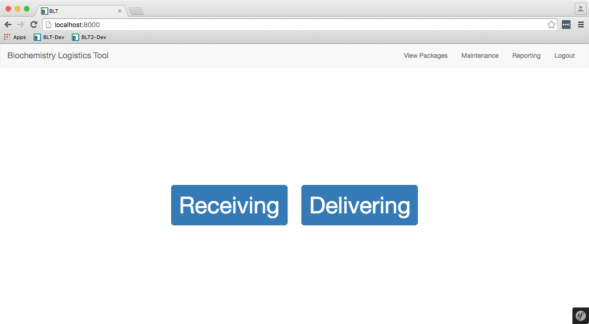
#### Receiving
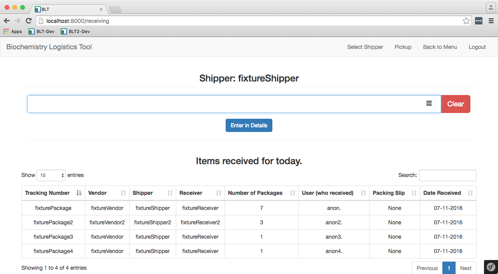
#### Delivering
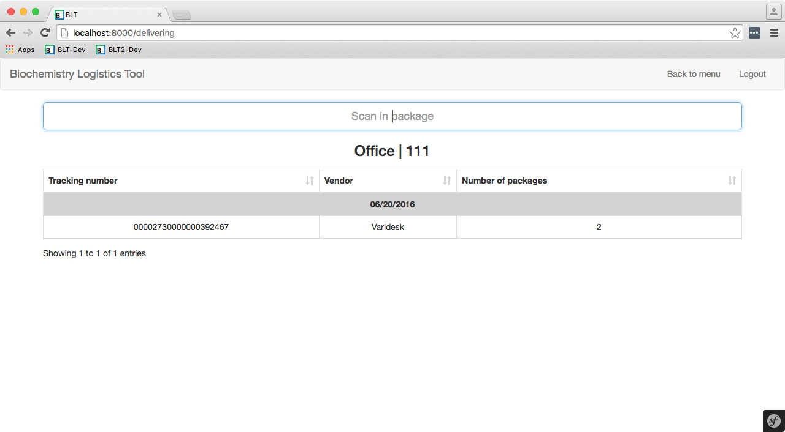
#### View
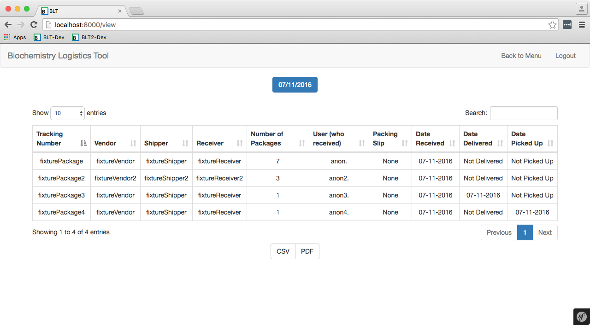
#### Reporting
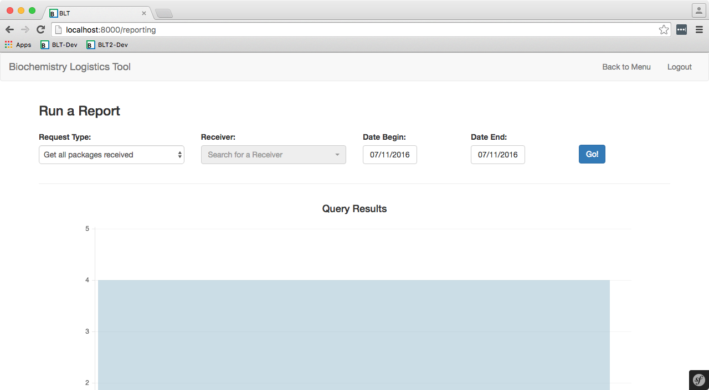
#### Maintenance
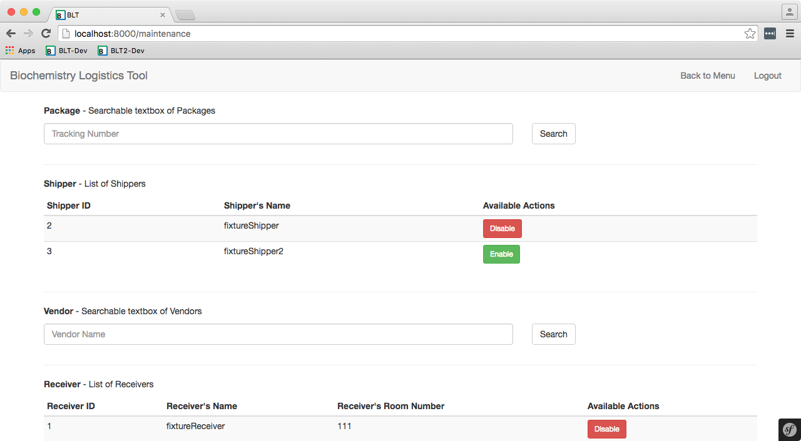

## Getting started
#### Introduction
After getting BLT2 up and running on your server, you'll have to add Receivers, Shippers, and Vendors to the database. You can either do this as Packages arrive or create a MySQL/MariaDB .sql file and import it into the database.

## Basics
### Creation of entities
The creation of entities are through the receiving page (/receiving).

#### Creating a new Shipper
Going to the receiving page (/receiving) will automatically prompt you to select a Shipper. From here, you can click on "Add new Shipper" to create a new Shipper.

##### Requirements for creating a new Shipper
- Name must be unique

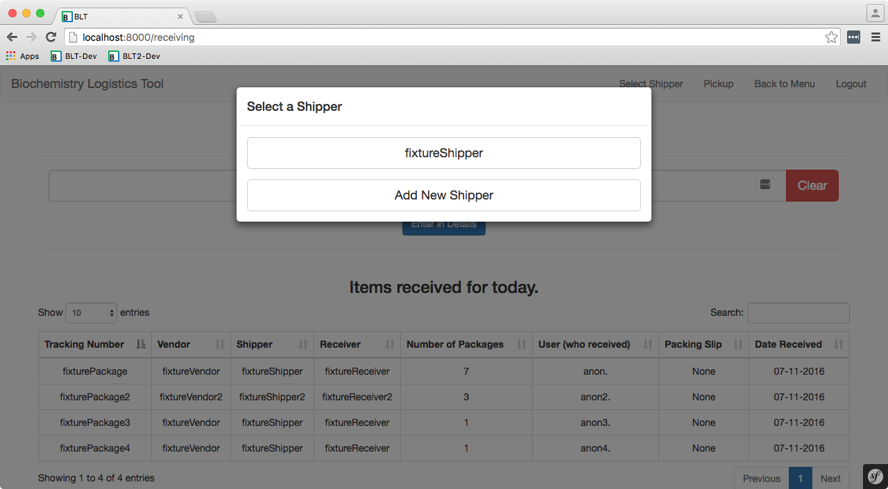 

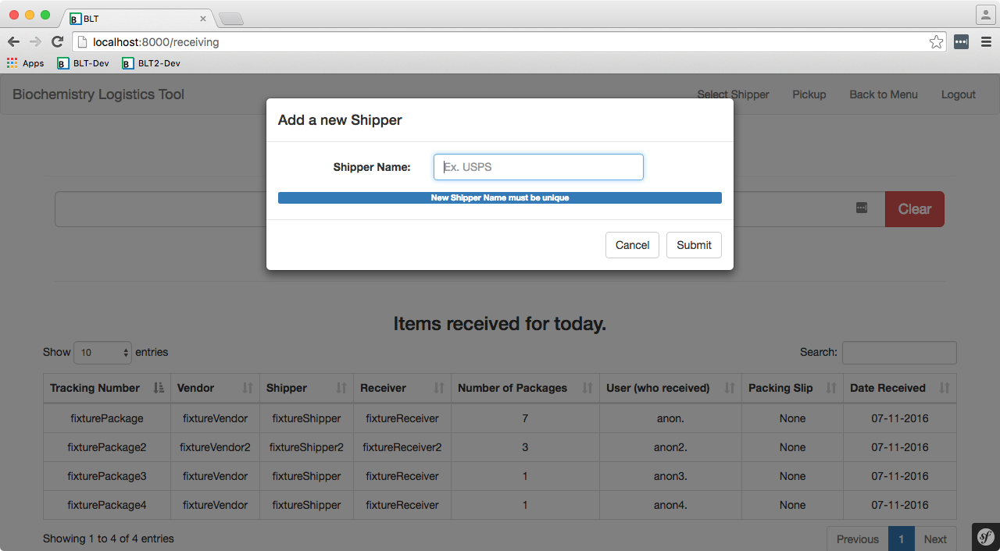

#### Creating a new Vendor
By scanning in a tracking number (or entering in text) into the tracking number input field and opening up the form by clicking on "Enter in details", you'll have the chance to create a new Vendor by clicking on "New" next to the Vendor search box.

##### Requirements for creating a new Vendor
- Name must be unique

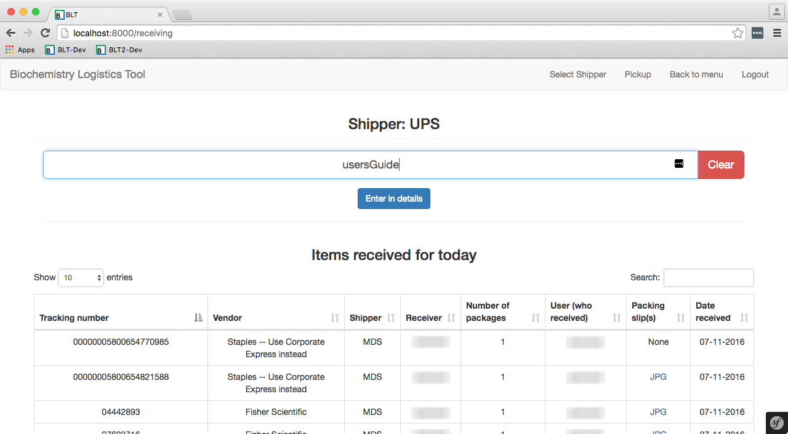 

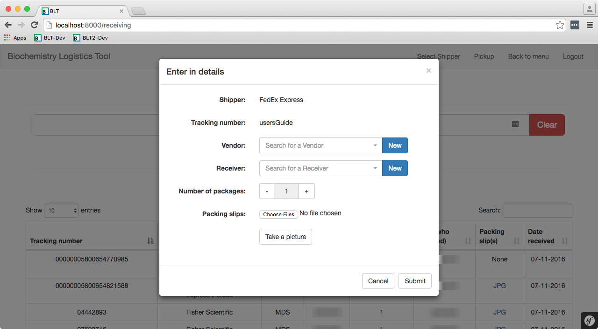

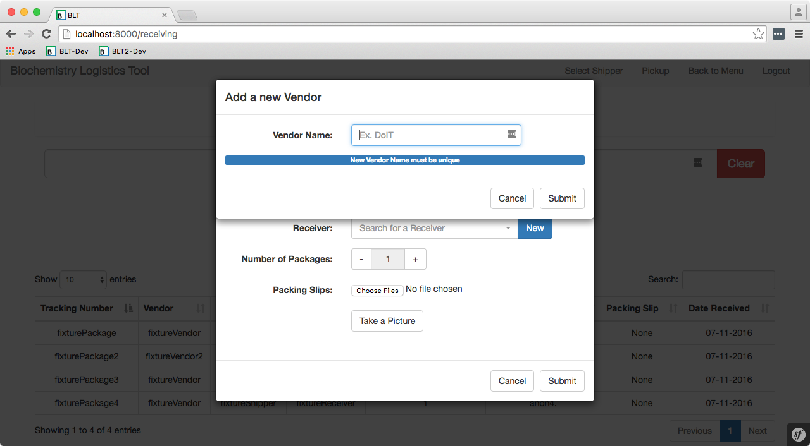

#### Creating a new Receiver
By scanning in a tracking number (or entering in text) into the tracking number input field and opening up the form by clicking on "Enter in details", you'll have the chance to create a new Receiver by clicking on "New" next to the Receiver search box.

##### Requirements for creating a new Receiver
- Name must be unique

 

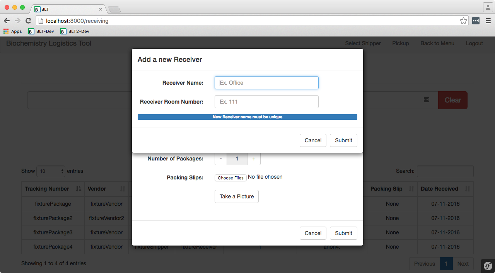

### Receiving
#### Submitting a new Package entity